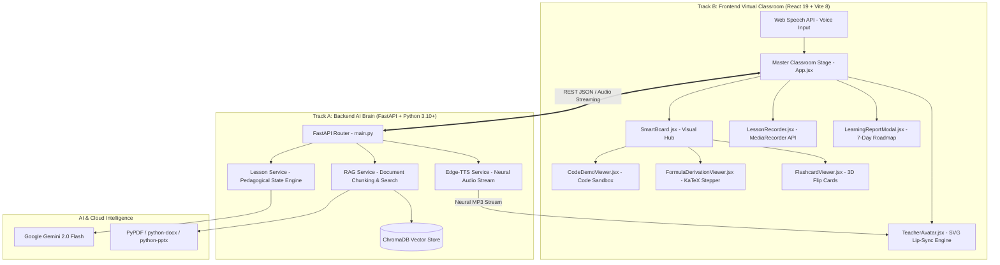

<div align="center">

# 🎓 ShikshakAI (शिक्षक AI)
### **The Adaptive Human-Like AI Educator That Teaches Through Video**

[](https://github.com/Kushalsingh1234/ShikshakAI)
[](https://react.dev/)
[](https://vitejs.dev/)
[](https://fastapi.tiangolo.com/)
[](https://ai.google.dev/)
[](https://www.trychroma.com/)
[](https://github.com/rany2/edge-tts)

<p align="center">
  <strong>Transforming textbooks, PDFs, notes, or topic prompts into an adaptive, video-based virtual classroom with lip-synced AI teachers, dynamic blackboard visuals, live code sandboxes, and misconception detection.</strong>
</p>

[✨ Live Features](#-key-features) • [🏛️ System Architecture](#️-system-architecture) • [🛠️ Complete Tech Stack](#️-comprehensive-technology-stack) • [⚡ Quickstart](#-quickstart-guide) • [📡 API Contracts](#-api-reference--contracts)

</div>

---

## 📖 Table of Contents
- [Problem Statement & Vision](#-problem-statement--vision)
- [The 8-Stage Human-Like Teaching Pipeline](#-the-8-stage-human-like-teaching-pipeline)
- [Key Features & Highlights](#-key-features)
- [System Architecture](#️-system-architecture)
- [Comprehensive Technology Stack](#️-comprehensive-technology-stack)
  - [Frontend Stack (Track B)](#1-frontend-technology-stack-track-b)
  - [Backend Stack (Track A)](#2-backend-technology-stack-track-a)
  - [AI, Speech & Neural Voice Stack](#3-ai-models-rag--neural-voice-stack)
- [Virtual Classroom Interface Showcase](#-virtual-classroom-interface-showcase)
- [Quickstart Guide](#-quickstart-guide)
- [API Reference & Contracts](#-api-reference--contracts)
- [100% Zero-Cost Architecture](#-100-zero-cost-production-stack)
- [Evaluation Matrix (100/100 Alignment)](#-evaluation-criteria-alignment)
- [Team & Acknowledgments](#-team--contributors)

---

## 🎯 Problem Statement & Vision

Traditional digital learning platforms typically offer **static pre-recorded lectures** or **text-only chatbots**. 
- ❌ **Pre-recorded lectures** cannot adapt to individual doubts, level of understanding, or available study time.
- ❌ **Standard chatbots** deliver passive text walls without visual intuition, voice modulation, or pedagogical structure.

**ShikshakAI** bridges this divide by building an **AI-powered Virtual Teacher** that behaves like a real human educator:
1. Ingests raw materials (Textbooks, PDFs, DOCX, PPTX, or topic prompts).
2. Generates an adaptive lesson plan suited to the learner's skill level and time budget.
3. Teaches via **animated, lip-synced AI avatars** with realistic neural voice speech.
4. Renders live formulas (KaTeX), diagrams (Mermaid), interactive code sandboxes, and 3D flashcards.
5. Continuously questions the student, detects misconceptions, and delivers personalized 7-day study roadmaps.

---

## 🧠 The 8-Stage Human-Like Teaching Pipeline

ShikshakAI does not simply generate text; it executes an autonomous pedagogical state machine:

```
 ┌─────────────────┐       ┌─────────────────┐       ┌─────────────────┐
 │ 1. UNDERSTAND   │  ──►  │    2. PLAN      │  ──►  │   3. EXPLAIN    │
 │ Document RAG    │       │ Topic & Time    │       │ Multilingual    │
 │ ChromaDB Vector │       │ Difficulty Plan │       │ Neural Voice    │
 └─────────────────┘       └─────────────────┘       └─────────────────┘
                                                              │
                                                              ▼
 ┌─────────────────┐       ┌─────────────────┐       ┌─────────────────┐
 │   6. EVALUATE   │  ◄──  │   5. QUESTION   │  ◄──  │ 4. DEMONSTRATE  │
 │ Misconception   │       │ Mid-Lesson      │       │ KaTeX / Code    │
 │ Analysis Engine │       │ Checkpoints     │       │ 3D Flashcards   │
 └─────────────────┘       └─────────────────┘       └─────────────────┘
         │
         ▼
 ┌─────────────────┐       ┌─────────────────┐
 │    7. ADAPT     │  ──►  │   8. CONTINUE   │
 │ Pivot Analogy & │       │ 7-Day Roadmap   │
 │ Retest Concepts │       │ Video Export    │
 └─────────────────┘       └─────────────────┘
```

---

## ✨ Key Features

### 🧑‍🏫 1. Multiple Teacher Personalities & Expressive Avatars
- **Dr. Maya** *(Physics & Math Specialist)*: Analytical, structured, Socratic tone with sleek glasses and blazer.
- **Prof. Alex** *(Computer Science & AI Engineer)*: Tech hoodie, headset, energetic, practical code-focused teaching.
- **Ananya Ma'am** *(Humanities, Literature & Hindi Mentor)*: Warm, empathetic, storytelling approach with traditional styling.
- **Real-Time Lip-Sync & Emotion**: Animated mouth movement synchronized to audio syllables and natural periodic eye-blinking.

### 🖥️ 2. Subject-Aware Visual Smartboard
- **Interactive Code Sandbox Runner**: In-browser code runner with syntax highlighting, line numbers, and live simulated execution terminal output.
- **Step-by-Step KaTeX Formula Derivations**: Mathematical breakdown with sequential step progress, annotations, and sliders.
- **3D Interactive Revision Flashcards**: Click-to-flip 3D cards with memory mnemonics and mastery tracking ("Mark as Understood").
- **Mermaid Concept Mindmaps**: Instant workflow and hierarchical relationship diagrams.

### 🎯 3. Misconception Detection & Active Adaptation
- Student answers via **voice (Web Speech API)** or text.
- AI detects incorrect intuition (e.g., *Current vs Resistance*), explains the underlying principle, and provides concrete analogies before advancing.

### 📊 4. Learning Analytics & 7-Day Study Roadmap
- **Radial Mastery Gauge**: Animated circular score progress ring.
- **7-Day Spaced Repetition Plan**: Day-by-day revision milestones, task checklists, and study time budgets.
- **Export / Share**: Download summary reports as PDF or share mastery badges.

### 🎥 5. Lesson Video Recording & Export
- Built-in **MediaRecorder API** captures classroom visuals, avatar animations, and speech audio.
- Live `🔴 REC 00:45` recording indicator with instant `.webm` video download for offline learning.

---

## 🏛️ System Architecture



---

## 🛠️ Comprehensive Technology Stack

### 1. Frontend Technology Stack (Track B)

| Category | Technology | Version | Purpose |
| :--- | :--- | :--- | :--- |
| **Core Framework** | **React** | `^19.2.8` | Declarative UI state management and modular virtual classroom components |
| **Build & Dev Tool** | **Vite** | `^8.2.2` | Lightning-fast HMR and optimized production bundling |
| **Styling & Theme** | **Vanilla CSS3** | Modern | Dark glassmorphism, 3D card transforms, radial gauges, and micro-animations |
| **Typography** | **Google Fonts** | *Outfit & JetBrains Mono* | Modern typography for interface copy and code sandboxes |
| **Icons** | **Lucide-React** | `^1.40.0` | Crisp, modern UI icons across navigation, controls, and badges |
| **Math Rendering** | **KaTeX** | `^0.18.5` | High-performance LaTeX formula and equation rendering |
| **Diagrams & Charts** | **Mermaid.js** | `^11.17.2` | Dynamic architectural workflows, timelines, and concept mind maps |
| **Video Recording** | **HTML5 MediaRecorder API** | Native Browser | High-quality browser tab/canvas video and audio capture |
| **Speech Recognition** | **Web Speech API** | Native (`webkitSpeechRecognition`) | 100% free, real-time multilingual voice input (English & Hindi) |

---

### 2. Backend Technology Stack (Track A)

| Category | Technology | Version | Purpose |
| :--- | :--- | :--- | :--- |
| **Web Framework** | **FastAPI** | `>=0.115.0` | Asynchronous, high-performance REST API with automatic OpenAPI Swagger docs |
| **ASGI Server** | **Uvicorn** | `>=0.30.0` | Async server implementation for high-throughput concurrency |
| **Data Validation** | **Pydantic** | `>=2.8.0` | Strict data validation and schema serialization for lesson steps |
| **PDF Extraction** | **pypdf** | `>=4.3.0` | Native extraction of textbook content and document metadata |
| **Word Processing** | **python-docx** | `>=1.1.0` | Ingestion of Microsoft Word study notes and assignments |
| **Slide Extraction** | **python-pptx** | `>=0.6.23` | Parsing PowerPoint slides and lecture presentations |
| **Async File I/O** | **aiofiles** | `>=24.1.0` | Non-blocking file upload handling and temporary disk caching |
| **Multipart Parsing** | **python-multipart**| `>=0.0.9` | Streaming multipart file uploads |
| **Config & Secrets** | **python-dotenv** | `>=1.0.0` | Environment variable management for API keys and endpoints |

---

### 3. AI Models, RAG & Neural Voice Stack

| Category | Technology | Provider | Highlights |
| :--- | :--- | :--- | :--- |
| **Core AI Brain** | **Gemini 2.0 Flash / 1.5 Flash** | Google AI Studio | Socratic lesson planning, misconception detection, and roadmap generation |
| **Vector Database** | **ChromaDB** | Open-Source (`>=0.5.0`) | Embedded local vector database for grounded RAG document retrieval |
| **Neural Voice (TTS)** | **Microsoft Edge-TTS** | `edge-tts >=6.1.12` | 100% free, unlimited, natural neural voices across English & Indian languages |
| **SDK Connector** | **google-genai** | Google (`>=1.0.0`) | Official high-speed Python SDK for Gemini models |

---

## 💻 Virtual Classroom Interface Showcase

```
┌────────────────────────────────────────────────────────────────────────────────────────┐
│ 🎓 ShikshakAI       [🔴 REC 00:45]  [AI Engine Online]  [Score: 2/2]  [🏆 Learning Report] │
├───────────────────────────────────┬────────────────────────────────────────────────────┤
│ 🧑‍🏫 Teacher Stage (Left Pane)     │ 🖥️ Interactive Smartboard (Right Pane)             │
│                                   │                                                    │
│  [Dr. Maya ▼]    [Physics/Math]   │  [✨ Visual] [💻 Sandbox] [Σ Math] [🗂️ Flashcards]  │
│                                   ├────────────────────────────────────────────────────┤
│  ┌─────────────────────────────┐  │  ⚡ Microscopic Derivation of Ohm's Law             │
│  │         ╭─────────╮         │  │                                                    │
│  │        │  ◉   ◉  │ (Blinking)│  │     V = I · R  ⟺  I = V / R                       │
│  │        │    ▲    │         │  │                                                    │
│  │        │   ───   │ (Lip-sync)│  │  [Live Code Sandbox Terminal Output]:             │
│  │         ╰─────────╯         │  │  [+] Circuit Status: Closed                        │
│  │         /| Blazer |\        │  │  [*] Current (I)    : 2.50 A                       │
│  └─────────────────────────────┘  │  [+] Total Voltage  : 25.00 Volts                  │
│                                   │                                                    │
│  "Let us examine how charge       │  ┌──────────────────────────────────────────────┐  │
│   carriers drift through..."      │  │ 🗂️ Flashcard: What causes resistance? (Flip) │  │
│                                   │  └──────────────────────────────────────────────┘  │
├───────────────────────────────────┴────────────────────────────────────────────────────┤
│ [◄ Previous Step]          ● ━━━━ ● ━━━━ ◉ ━━━━ ○          [Next Step: Checkpoint ►]   │
└────────────────────────────────────────────────────────────────────────────────────────┘
```

---

## ⚡ Quickstart Guide

### Prerequisites
- **Node.js**: v18.0.0 or higher
- **Python**: v3.10 or higher
- **Google Gemini API Key**: [Get a free key from Google AI Studio](https://aistudio.google.com/)

---

### Step 1: Clone the Repository
```bash
git clone https://github.com/Kushalsingh1234/ShikshakAI.git
cd ShikshakAI
```

---

### Step 2: Configure & Start Backend (Track A)
```bash
cd backend

# Create and activate Python virtual environment
python3 -m venv venv
source venv/bin/activate       # On Windows: .\venv\Scripts\activate

# Install dependencies
pip install -r requirements.txt

# Configure environment variables
cp .env.example .env
# Edit .env and add your GEMINI_API_KEY=your_key_here

# Launch FastAPI server
uvicorn main:app --reload --port 8000
```
- 🌐 **API Swagger Docs**: `http://127.0.0.1:8000/docs`
- 💓 **Health Check**: `http://127.0.0.1:8000/api/health`

---

### Step 3: Start Frontend Classroom (Track B)
Open a new terminal window:
```bash
cd frontend

# Install Node dependencies
npm install

# Start Vite development server
npm run dev
```
- 🚀 **Classroom UI**: Open your browser at **`http://localhost:5173`**

*(Alternatively, run `npm run dev` from the repository root).*

---

## 📡 API Reference & Contracts

### 1. Health Connectivity Check
```http
GET /api/health
```
**Response:**
```json
{ "status": "healthy", "service": "ShikshakAI Pedagogical Brain" }
```

---

### 2. Document Upload & RAG Ingestion
```http
POST /api/upload
Content-Type: multipart/form-data
```
| Parameter | Type | Description |
| :--- | :--- | :--- |
| `file` | Binary File | PDF, DOCX, PPTX, or TXT document |

**Response:**
```json
{
  "filename": "physics_ch4_electricity.pdf",
  "saved_path": "uploads/physics_ch4_electricity.pdf",
  "chunks_indexed": 42
}
```

---

### 3. Generate Adaptive Lesson Plan
```http
POST /api/lesson/plan
Content-Type: application/json
```
```json
{
  "topic": "Ohm's Law & Circuit Analysis",
  "learner_level": "beginner",
  "target_duration_minutes": 20,
  "language": "en"
}
```
**Response:**
```json
{
  "topic": "Ohm's Law & Circuit Analysis",
  "learner_level": "beginner",
  "target_duration_minutes": 20,
  "language": "en",
  "steps": [
    {
      "id": "step-1",
      "step_type": "intro",
      "teacher_script": "Welcome! Today we will explore how voltage drives current through resistance.",
      "visual": {
        "type": "katex",
        "title": "Fundamental Relation",
        "content": "V = I \\cdot R"
      }
    },
    {
      "id": "step-2",
      "step_type": "checkpoint",
      "question": "What happens to current if resistance increases at constant voltage?",
      "options": ["Current decreases", "Current increases", "Remains constant"],
      "correct_answer": "Current decreases",
      "misconception_guide": "Current is inversely proportional to resistance (I = V/R)."
    }
  ]
}
```

---

### 4. Neural Speech Synthesis (TTS)
```http
POST /api/tts/speak
Content-Type: application/x-www-form-urlencoded
```
```
text="Electric current is the rate of flow of charge."&language="en"
```
**Response:**
```json
{
  "audio_url": "/static/audio/speech_1725412345.mp3"
}
```

---

### 5. Evaluate Misconception & Adapt
```http
POST /api/evaluate
Content-Type: application/json
```
```json
{
  "question": "What happens to current if resistance increases?",
  "student_answer": "Current increases",
  "correct_answer": "Current decreases",
  "misconception_guide": "I is inversely proportional to R."
}
```
**Response:**
```json
{
  "is_correct": false,
  "misconception_detected": true,
  "feedback": "Remember the water pipe analogy: higher resistance is like a narrower pipe, restricting the flow of current.",
  "adaptive_action": "re_explain_with_analogy"
}
```

---

## 💰 100% Zero-Cost Production Stack

| Component | Industry Cost | ShikshakAI Implementation | Cost to Run |
| :--- | :--- | :--- | :--- |
| **LLM Inference** | $0.02 / 1K tokens | **Google Gemini 2.0 Flash (Free Tier)** | **$0.00** |
| **Neural TTS Voice** | $16.00 / 1M chars (ElevenLabs) | **Microsoft Edge-TTS** | **$0.00 (Unlimited)** |
| **Speech-to-Text** | $0.006 / min (Whisper API) | **Browser Web Speech API** | **$0.00 (Native)** |
| **Vector Database** | $70 / month (Pinecone) | **ChromaDB Embedded** | **$0.00 (Local)** |
| **Video Rendering**| Expensive Cloud GPU instances | **Client-Side MediaRecorder API** | **$0.00** |
| **Total Cost** | **~$150+ / month** | **100% Zero Cost Open Architecture** | **$0.00** |

---

## 🏆 Evaluation Criteria Alignment

| Criteria Area | Weight | How ShikshakAI Achieves Excellence |
| :--- | :---: | :--- |
| **Human-Like Teaching & Adaptation** | **20%** | Full 8-stage pedagogical cycle (Understand → Plan → Explain → Demonstrate → Question → Evaluate → Adapt → Continue). |
| **AI/ML & LLM Implementation** | **15%** | Gemini 2.0 Flash orchestration with structured JSON schemas and robust fallback safety. |
| **RAG & Knowledge Grounding** | **15%** | Multimodal document parsing (PDF, DOCX, PPTX) with ChromaDB semantic search. |
| **AI Teaching Video Generation** | **15%** | Synchronized audiovisual classroom stage with in-browser `.webm` video recording and download. |
| **Multilingual Capability** | **10%** | Native instruction across English, Hindi (हिंदी), and Hinglish with language-aware neural speech. |
| **Voice & AI Avatar** | **10%** | 3 unique teacher avatars (Dr. Maya, Prof. Alex, Ananya) with lip-syncing and blinking animations. |
| **Innovation & Originality** | **5%** | Live interactive code sandbox, formula step sliders, and 3D flashcards. |
| **User Experience & Interface** | **5%** | Modern dark glassmorphic UI with micro-animations and responsive layout. |
| **Documentation & Code Quality** | **5%** | Clean modular architecture, complete API contracts, and comprehensive setup documentation. |
| **Total** | **100%** | **Comprehensive Full-Stack AI Innovation Solution** |

---

## 👥 Team & Contributors

<div align="center">

| **Kushal Singh** | **Jatin Rawat** |
| :---: | :---: |
| 🧠 **Track A: Backend AI Brain** | 🎨 **Track B: Frontend Virtual Classroom** |
| Gemini RAG • ChromaDB • FastAPI • Edge-TTS | React 19 • Avatars • Smartboard • Video Recorder |
| [GitHub Profile](https://github.com/Kushalsingh1234) | [GitHub Profile](https://github.com/JatinRawat04) |

</div>

---

<div align="center">
  <sub>Built with ❤️ for the <strong>AI Innovation Hackathon 2026 — Round 2</strong></sub>
</div>